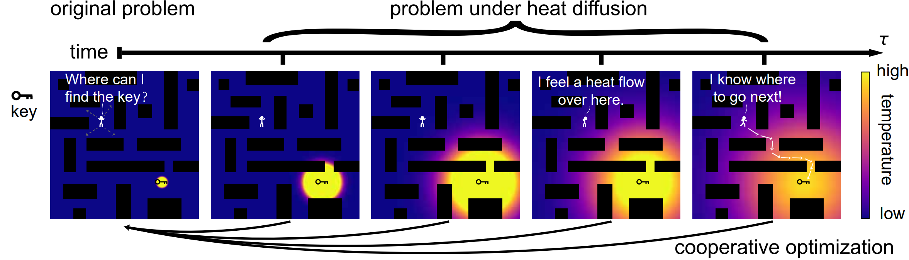

# Efficient Combinatorial Optimization via Heat Diffusion
###  [Paper](https://arxiv.org/abs/2403.08757)
> [**Efficient Combinatorial Optimization via Heat Diffusion**](https://arxiv.org/abs/2403.08757),            
> Hengyuan Ma, Wenlian Lu, and Jianfeng Feng   
> **NeurIPS 2024**

## Abstract
Combinatorial optimization problems are widespread but inherently challenging due to their discrete nature. The primary limitation of existing methods is that they can only access a small fraction of the solution space at each iteration, resulting in limited efficiency for searching the global optimal. To overcome this challenge, diverging from conventional efforts of expanding the solver’s search scope, we focus on enabling information to actively propagate to the solver through heat diffusion. By transforming the target function while preserving its optima, heat diffusion facilitates information flow from distant regions to the solver, providing more efficient navigation. Utilizing heat diffusion, we propose a framework for solving general combinatorial optimization problems. The proposed methodology demonstrates superior performance across a range of the most challenging and widely encountered combinatorial optimizations. Echoing recent advancements in harnessing thermodynamics for generative artificial intelligence, our study further reveals its significant potential in advancing combinatorial optimization.

## Demo

The ***Heat Diffusion Optimization (HeO)*** framework. The efficiency of searching a key in a dark room is significantly improved by employing navigation that utilizes heat emission from the key. In our framework, heat diffusion transforms the target function of a combinatorial optimization problem into different versions while preserving the location of the optima. Therefore, the gradient information of these transformed functions cooperatively help to optimize the original target function.

## Requirement
- Python 3.7
- numpy 1.21.6
- torch 1.11.0


## Running the Experiments

Experiments for quadratic unconstrained binary optimization (QUBO): `qubo.py`.
```
$ python qubo.py
```

Experiments for boolean 3-satisfiability (3-SAT): `sat.py`.
```
$ python sat.py
```

Experiments for training a network with ternary-value parameters: `tenaray_nn.py`.
```
$ python tenaray_nn.py
```

Experiments for variable selection of linear regression: `variable_selection.py`.
```
$ python variable_selection.py
```

Experiments for minimum vertex cover (MVC): `mvc.py`.
```
$ python mvc.py
```

## License

[MIT](LICENSE)
## Reference

```bibtex
@inproceedings{ma2024heo,
  title={Efficient Combinatorial Optimization via Heat Diffusion},
  author={Ma, Hengyuan and Lu, Wenlian and Feng, Jianfeng},
  booktitle={Advances in Neural Information Processing Systems},
  year={2024}
}
```